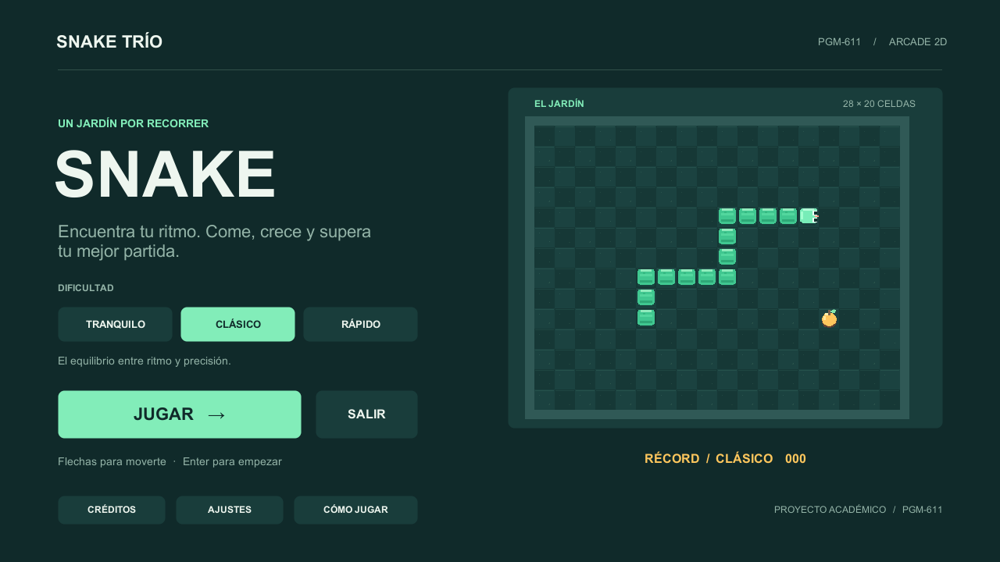
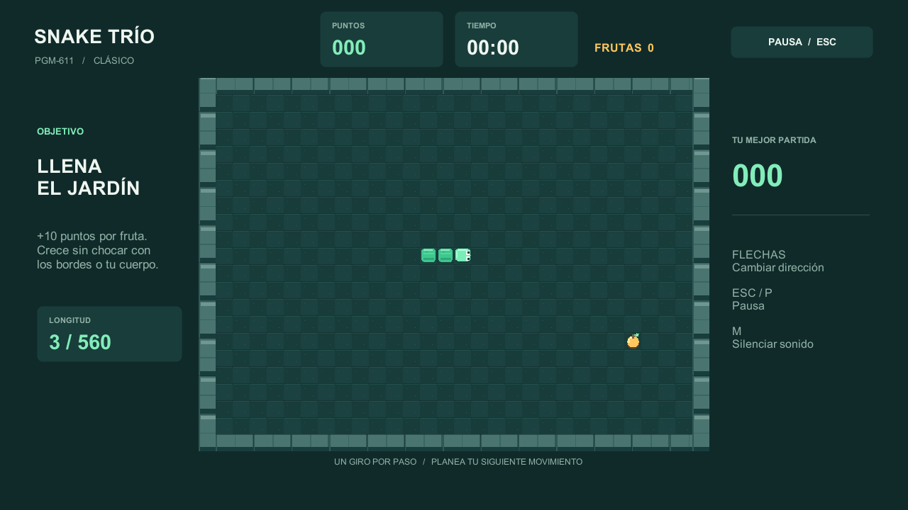
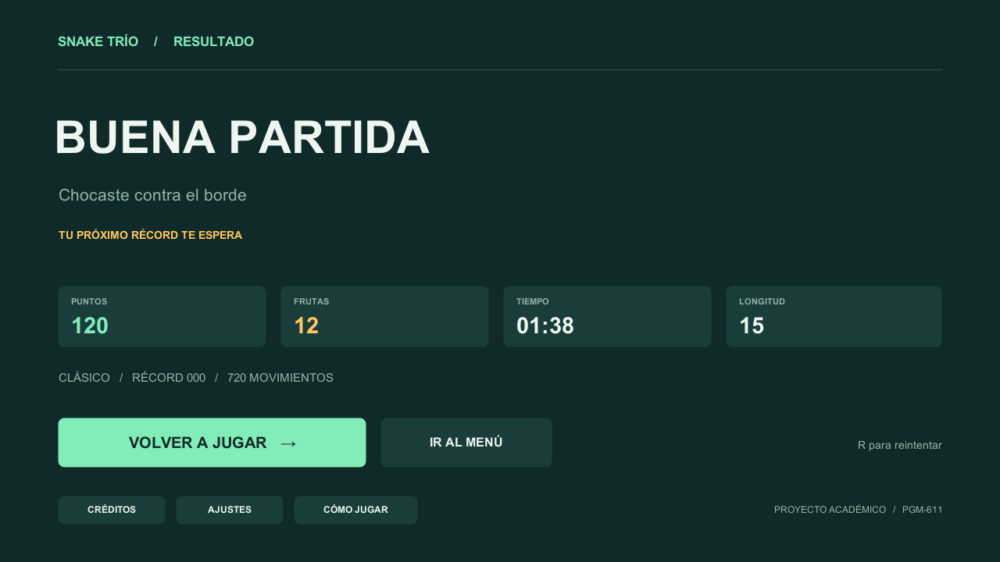

# Snake Trío · PGM-611

Proyecto académico de videojuego 2D desarrollado en **Unity 6 y C#** para la asignatura **PGM-611**. El objetivo es controlar una serpiente, recoger frutas y aumentar la puntuación sin chocar contra los bordes ni contra su propio cuerpo.

## Integrantes

| Integrante | GitHub |
| --- | --- |
| Alejandro Villalpando Rojas | [Alexwuuu1](https://github.com/Alexwuuu1) |
| Galilea Alison Llusco Asistiri | [Galileya](https://github.com/Galileya) |
| Cristopher Iori Lazcano Gutierrez | [Crisshubb](https://github.com/Crisshubb) |

## Ejecutable para Windows

[Descargar Snake Trío v1.2.0](https://github.com/Alexwuuu1/juego-2d-snake-PGM-611/releases/download/v1.2.0/SnakeTrio-Windows-v1.2.0.zip)

Extraer el ZIP completo y abrir `SnakeTrio.exe`. Mantener junto al ejecutable la carpeta `SnakeTrio_Data` y las DLL incluidas. No es necesario instalar Unity para jugar.

## Características

- Tablero de 28 × 20 celdas con sprites editables en Aseprite y suelo Tilemap.
- Tres dificultades: Tranquilo, Clásico y Rápido.
- Cada fruta suma 10 puntos y un segmento a la serpiente.
- Colisiones con bordes y cuerpo; victoria al completar el tablero.
- Tres escenas: menú, juego y resultado.
- Música, efectos de comida, choque, victoria y botones.
- Ayuda, créditos y ajustes con volumen de música y efectos independientes.
- Pausa automática al cambiar de ventana y cuenta breve al reanudar.
- Confirmación antes de reiniciar o abandonar la partida desde la pausa.
- Resultados con tiempo, frutas, longitud, movimientos y récord por dificultad.
- Dificultad, sonido y récords guardados localmente.

## Controles

| Tecla | Acción |
| --- | --- |
| Flechas | Cambiar dirección |
| Esc o P | Pausar o continuar |
| Enter | Activar el botón seleccionado o comenzar desde el menú |
| R | Volver a jugar desde el resultado |
| M | Silenciar o reactivar sonido |
| F1 | Abrir ayuda desde el menú o resultado |
| F12 | Guardar una captura junto al ejecutable |

La serpiente no puede girar directamente 180 grados. Se procesa un giro por avance.

## Proyecto en Unity

Versión del editor: **6000.3.11f1**.

1. Abrir esta carpeta como proyecto desde Unity Hub.
2. Abrir `Assets/Scenes/Menu.unity` y pulsar **Play**.
3. Para generar el ejecutable: **Snake Trío → Compilar Windows**.

La compilación se genera en `Builds/Windows-v1.2/SnakeTrio.exe`. Las escenas, los prefabs, las animaciones y los recursos están incluidos en el repositorio.

## Estructura

| Carpeta | Contenido |
| --- | --- |
| `Assets/Scenes` | Menu, Juego y Resultado |
| `Assets/Sprites/Aseprite` | Fuentes editables `.aseprite` de serpiente, fruta, suelo y bordes |
| `Assets/Sprites/Snake`, `Food`, `Environment` | Exportaciones PNG originales |
| `Assets/Prefabs` | Cabeza, segmentos, comida y paredes |
| `Assets/Tiles` | Baldosas del tablero |
| `Assets/Animations` | Parpadeo de cabeza y brillo de fruta |
| `Assets/Materials` | Material físico sin fricción |
| `Assets/Scripts/Core` | Reglas, movimiento, colisiones y preferencias |
| `Assets/Scripts/Presentation` | Interfaz, sonido y comprobaciones del ejecutable |
| `Assets/Editor` | Preparación de escenas, validación y compilación |
| `docs/capturas` | Imágenes del juego |

Unity importa directamente las fuentes `.aseprite` mediante **2D Aseprite Importer 3.0.2**, con filtro **Point** y 32 píxeles por unidad. La cabeza y la fruta tienen dos frames; el parpadeo y el brillo toman sus imágenes y tiempos de esos archivos. Los PNG originales se conservan como exportaciones. La cabeza utiliza un **Rigidbody2D cinemático**, sin gravedad y con rotación bloqueada. Los **BoxCollider2D** de bordes y segmentos participan en las consultas de colisión de `Physics2D`. La comida utiliza un collider de tipo trigger. El movimiento y las reglas se implementan en C# por celdas.

## Validación

En el editor, **Snake Trío → Validar reglas** comprueba dirección, crecimiento, puntuación, comida en celdas libres, choques, cola y victoria. El ejecutable incluye una comprobación de inicio, ajustes, pausa, componentes físicos, comida, crecimiento y transición al resultado:

```powershell
.\SnakeTrio.exe --smoke-test -batchmode -nographics -logFile prueba.log
```

La versión Windows publicada pasó la compilación y las pruebas del ejecutable. Las pantallas también fueron revisadas visualmente.

## Capturas






